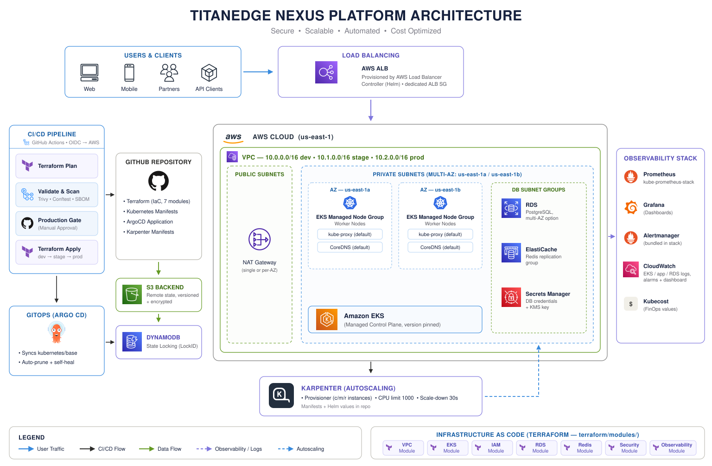

# TitanEdge Nexus Platform

[](https://github.com/ccarrylab/titanedge-nexus-platform/actions/workflows/platform-ci.yml)
[](https://github.com/ccarrylab/titanedge-nexus-platform/actions/workflows/trivy.yml)
[](https://github.com/ccarrylab/titanedge-nexus-platform/actions/workflows/sbom.yml)
[](https://terraform.io)
[](LICENSE)

A production-grade AWS platform built with Terraform, EKS, and GitHub Actions. Every component rebuilds from `terraform apply` — no manual steps, no eksctl, no out-of-band configuration.

## Architecture



> **Diagram reflects the actual repository.** Components shown are verified against `terraform/modules/`, `.github/workflows/`, and `kubernetes/`. The diagram was generated by scanning this repo — not from a generic template.

### How it fits together

Traffic enters the cluster through the **AWS ALB**, provisioned by the in-cluster AWS Load Balancer Controller (installed via Helm). **GitHub Actions** drives the full pipeline: Terraform plan → security scan (Trivy, Conftest, SBOM) → manual production gate → chained apply across dev → stage → prod, all authenticated to AWS via **GitHub OIDC** (no static keys). **Argo CD** then reconciles whatever Kubernetes manifests land in `kubernetes/base`, self-healing any drift automatically.

The **EKS control plane** (managed, version-pinned) runs worker nodes across `us-east-1a` and `us-east-1b`. **Karpenter** handles node autoscaling for the workload tier. **RDS PostgreSQL** and **ElastiCache Redis** sit in dedicated subnet groups within the private subnets; credentials are auto-generated and stored in **Secrets Manager**, never in code or state. **CloudWatch** aggregates EKS, application, and RDS logs with a CPU alarm and platform dashboard.

## What this builds

| Layer | Resources | Module |
|---|---|---|
| Networking | VPC, 2× public + 2× private subnets, IGW, NAT, route tables | `vpc` |
| Compute | EKS 1.35 cluster + managed node group (TF-owned) | `eks` |
| Security | 4 VPC-bound security groups (ALB → EKS → RDS → Redis) | `security` |
| Data | RDS PostgreSQL 16, ElastiCache Redis 7.1 | `rds`, `redis` |
| IAM | GitHub OIDC role, S3 state bucket, DynamoDB lock table | `iam` |
| Observability | CloudWatch log groups, CPU alarm, platform dashboard | `observability` |

## Quick start

**Prerequisites:** Terraform ≥ 1.5.0, AWS CLI configured, Go ≥ 1.22, kubectl.

```bash
git clone https://github.com/ccarrylab/titanedge-nexus-platform.git
cd titanedge-nexus-platform

cp terraform/environments/dev/terraform.tfvars.example \
   terraform/environments/dev/terraform.tfvars

make test          # static + unit tests — no AWS needed
make test-unit     # terraform test with mocked AWS provider

cd terraform/environments/dev
terraform init
terraform plan
terraform apply    # ~15 min — EKS cluster is the slow part
terraform plan     # must say: No changes.

$(terraform output -raw configure_kubectl)
kubectl get nodes
```

## Test suite — three layers

```
make test-static       # Go stdlib, no credentials, runs in <1 second
                       # catches: hardcoded secrets, stray tfplan files,
                       # missing module files, unbound security groups

make test-unit         # terraform test with mock_provider "aws"
                       # catches: wrong CIDRs, missing k8s ELB tags,
                       # single-AZ violations, bad NAT gateway mode

make test-integration  # Terratest against real AWS (plan-only by default)
                       # set TERRATEST_APPLY=1 for apply/destroy lifecycle
```

## Security highlights

- Passwords auto-generated, stored in AWS Secrets Manager — never in code or state
- GitHub Actions uses OIDC (short-lived credentials, no static keys)
- RDS and Redis isolated in private subnets, no public access
- EKS secrets encrypted with rotating KMS key
- State bucket: versioned, AES-256, public access blocked
- State locking: DynamoDB prevents concurrent plan corruption

## Environment differences (all via tfvars)

| Setting | dev | prod |
|---|---|---|
| `single_nat_gateway` | `true` (cheaper) | `false` (per-AZ HA) |
| `rds_multi_az` | `false` | `true` |
| `rds_deletion_protection` | `false` | `true` |
| `eks_endpoint_public_access` | `true` | `false` (private-only; access via VPN/bastion) |
| `eks_public_access_cidrs` | `["0.0.0.0/0"]` | `[]` (no public endpoint to allowlist) |
| `node_instance_types` | `["t3.small"]` | `["t3.medium"]` |

## Operational runbooks

- [Rotate IAM credentials](docs/runbooks/rotate-iam.md)
- [Handle Terraform state lock](docs/runbooks/state-unlock.md)
- [Promote release to production](docs/runbooks/promote.md)

## Cost (dev environment)

| Service | Monthly |
|---|---|
| EKS control plane | ~$73 |
| NAT gateway | ~$32 |
| EC2 (t3.small × 1) | ~$15 |
| RDS (db.t3.micro) | ~$15 |
| ElastiCache (cache.t3.micro) | ~$12 |
| **Total** | **~$147** |

`terraform destroy` tears down everything in one command.
